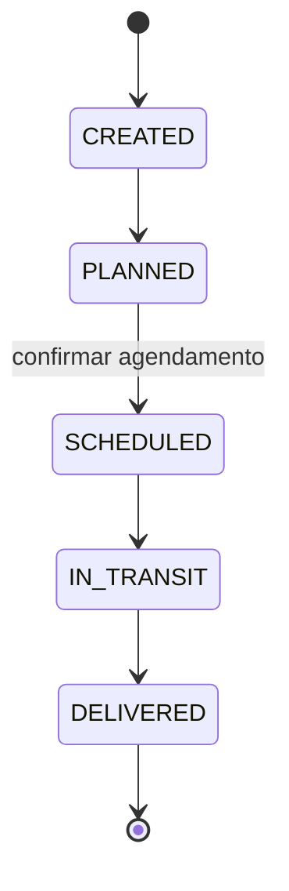

# OVGS — Sistema de Gestão de Ordens de Venda

Uma aplicação frontend para gerenciar todo o ciclo de vida das **Ordens de Venda**:
cadastros, criação de ordens, uma máquina de estados operacional, agendamento de entregas,
monitoramento operacional e uma trilha de auditoria.

O backend é totalmente **simulado com o Mock Service Worker (MSW)**, de modo que a aplicação roda de
ponta a ponta sem qualquer serviço externo, mantendo uma fronteira REST realista que poderia ser
substituída por uma API real apenas alterando um único valor de configuração.

> O código, as pastas e os identificadores estão em **inglês**, enquanto os textos de interface e a
> documentação estão em **português**, conforme solicitado no desafio.

---

## Sumário

- [Stack tecnológica](#stack-tecnológica)
- [Como começar](#como-começar)
- [Scripts disponíveis](#scripts-disponíveis)
- [Executando com Docker](#executando-com-docker)
- [Estrutura do projeto](#estrutura-do-projeto)
- [Visão geral das funcionalidades](#visão-geral-das-funcionalidades)
- [Estratégia de modelagem de domínio](#estratégia-de-modelagem-de-domínio)
- [Regras de negócio](#regras-de-negócio)
- [Ciclo de vida da ordem (máquina de estados)](#ciclo-de-vida-da-ordem-máquina-de-estados)
- [Decisões de arquitetura](#decisões-de-arquitetura)
- [Estratégia de persistência](#estratégia-de-persistência)
- [Estratégia de testes](#estratégia-de-testes)
- [Considerações de escalabilidade](#considerações-de-escalabilidade)
- [Considerações de performance](#considerações-de-performance)
- [Trade-offs](#trade-offs)

---

## Stack tecnológica

| Área                  | Escolha                                                    |
| --------------------- | ---------------------------------------------------------- |
| Biblioteca de UI      | **React 19**                                               |
| Ferramenta de build   | **Vite**                                                   |
| Linguagem             | **TypeScript** (strict)                                    |
| Roteamento            | **TanStack Router** (type-safe, árvore de rotas em código) |
| Estado do servidor    | **TanStack Query (React Query)**                           |
| Estado global/cliente | **Redux Toolkit**                                          |
| Efeitos colaterais    | **Redux Saga** (trilha de auditoria + efeitos globais)     |
| Estilização           | **Tailwind CSS v4**                                        |
| Formulários           | **React Hook Form**                                        |
| Validação             | **Zod**                                                    |
| Cliente HTTP          | **Axios**                                                  |
| API simulada          | **MSW (Mock Service Worker)**                              |
| Ícones                | lucide-react                                               |
| Datas                 | date-fns                                                   |
| Testes                | **Vitest** + **React Testing Library** + MSW               |
| Qualidade             | ESLint, Prettier, Husky, lint-staged                       |
| Entrega               | Docker (build multi-stage) + Docker Compose + nginx        |

---

## Como começar

**Requisitos:** Node.js 20+ (desenvolvido no Node 22 — veja o `.nvmrc`) e npm 10+.

```bash
# use a versão de Node fixada
nvm use

# instale as dependências
npm install

# inicie o servidor de desenvolvimento → http://localhost:5173
npm run dev
```

A API simulada inicia automaticamente em desenvolvimento; nenhuma configuração adicional é
necessária. Os dados iniciais (clientes, tipos de transporte, itens e algumas ordens) já ficam
disponíveis no primeiro carregamento.

## Scripts disponíveis

| Script                  | Descrição                                       |
| ----------------------- | ----------------------------------------------- |
| `npm run dev`           | Inicia o servidor de desenvolvimento do Vite    |
| `npm run build`         | Verifica os tipos e gera o build de produção    |
| `npm run preview`       | Pré-visualiza o build de produção               |
| `npm run lint`          | Executa o ESLint                                |
| `npm run format`        | Formata com o Prettier                          |
| `npm run typecheck`     | Verifica os tipos do projeto inteiro (`tsc -b`) |
| `npm run test`          | Executa a suíte de testes uma vez               |
| `npm run test:watch`    | Executa os testes em modo watch                 |
| `npm run test:coverage` | Executa os testes com relatório de cobertura    |

## Executando com Docker

A imagem de produção gera o bundle estático e o serve com o nginx (fallback de SPA + gzip +
cache de longa duração para os assets).

```bash
docker compose up --build
# aplicação servida em http://localhost:8080
```

## Estrutura do projeto

O código segue uma **arquitetura baseada em funcionalidades** com uma direção de dependência clara:
`features` e `app` dependem de `shared`; `shared` não depende de nada específico da aplicação.

```
src/
├── app/                    # Shell da aplicação
│   ├── config/             # Configuração de runtime tipada (URL base da API, flag de mocks)
│   ├── layouts/            # Layout raiz (sidebar + header)
│   ├── providers/          # Providers de Redux + Query + Router
│   ├── router/             # Árvore de rotas em código e configuração de navegação
│   └── store/              # Store Redux, root reducer, root saga, hooks tipados
│
├── shared/                 # Blocos transversais de construção
│   ├── api/                # Cliente Axios, Query client, query keys
│   ├── components/         # UI kit (Button, Modal, DataTable, ...) + primitivas de página
│   ├── lib/                # cn(), helpers de erro
│   ├── types/              # Tipos das entidades de domínio (fonte única de vocabulário)
│   └── utils/              # Formatadores (moeda, datas, documento)
│
├── features/               # Módulos de funcionalidade autocontidos
│   ├── dashboard/          # Visão operacional
│   ├── customers/          # Cadastro de clientes (CRUD)
│   ├── transport-types/    # Cadastro de tipos de transporte (CRUD)
│   ├── items/              # Catálogo de itens (criação + busca)
│   ├── sales-orders/       # Ordens: lógica de domínio, api, queries, telas
│   │   └── domain/         # Lógica pura: máquina de estados, regras, rótulos de status/agendamento
│   ├── scheduling/         # Central de agendamento
│   ├── monitoring/         # Monitoramento operacional filtrado
│   └── audit/              # Trilha de auditoria (saga + tela)
│
├── mocks/                  # MSW: banco em memória, seed e handlers de requisição
└── tests/                  # Setup de testes e helpers de renderização
```

Cada funcionalidade normalmente expõe: `api.ts` (chamadas HTTP), `queries.ts` (hooks de React Query),
`schema.ts` (Zod), `domain/` (lógica pura) e `components/` (telas).

## Visão geral das funcionalidades

- **Ordens de Venda** — criar, listar, detalhar; avançar o status pelo ciclo de vida; alterar o transporte.
- **Central de Agendamento** — definir data de entrega + janela de atendimento, confirmar e reagendar.
- **Monitoramento** — filtrar ordens por status, cliente, tipo de transporte e intervalo de datas de criação.
- **Painel** — métricas por status e ordens recentes.
- **Cadastros** — clientes (com tipos de transporte autorizados), tipos de transporte, itens.
- **Trilha de Auditoria** — registro cronológico de criação de ordens e alterações de status, agendamento e transporte.

## Estratégia de modelagem de domínio

As entidades vivem em `shared/types` como o vocabulário compartilhado, enquanto o comportamento fica
próximo da funcionalidade que o detém (`features/sales-orders/domain`).

- **Customer** — detém `authorizedTransportTypeIds`, âncora da regra de autorização de transporte.
- **TransportType** — modelado como **dado, não como enum**, para que novas modalidades sejam
  adicionadas pelo cadastro sem qualquer alteração de código (requisito explícito).
- **Item** — entrada de catálogo com um **SKU** único; assume-se que já exista e seja referenciado por ordens.
- **SalesOrder** — pertence a exatamente um cliente e um tipo de transporte, contém **linhas de item
  que fazem um snapshot** de SKU/nome/preço no momento da criação (para que edições posteriores no
  catálogo nunca reescrevam o histórico), um `status` de ciclo de vida e um `Schedule` opcional embutido.
- **AuditEvent** — registro imutável com timestamp, ação, entidade e estado anterior/próximo.

O **fluxo de status é em inglês no código** (`CREATED`, `PLANNED`, `SCHEDULED`, `IN_TRANSIT`,
`DELIVERED`) e mapeado para rótulos de exibição na camada de UI, desacoplando os valores de domínio
da apresentação.

## Regras de negócio

- Uma ordem só pode ser criada com um tipo de transporte **autorizado para o cliente selecionado**.
- Uma ordem deve pertencer a **um cliente**, ter **exatamente um tipo de transporte** e **pelo menos um
  item**.
- Apenas transições de status **válidas e somente para frente** são permitidas; qualquer outra é rejeitada (HTTP 422).
- Atingir `SCHEDULED` requer um **agendamento confirmado** (imposto pelo fluxo de agendamento).
- O transporte só pode ser alterado **antes do despacho** (`IN_TRANSIT`/`DELIVERED` o bloqueiam).

As regras são implementadas como **funções puras** e impostas em dois lugares: no cliente, para
feedback imediato de UX, e na API simulada, como a fronteira autoritativa (como faria um backend real).

## Ciclo de vida da ordem (máquina de estados)



A tabela de transições é orientada a dados (`ALLOWED_TRANSITIONS`), de modo que evoluir o fluxo (por
exemplo, adicionar um ramo de cancelamento) é uma mudança de dados, não uma reescrita do código consumidor.

## Decisões de arquitetura

- **Estado de servidor e estado de cliente são separados.** O React Query detém tudo o que vem da
  API (ordens, cadastros, auditoria) com cache e invalidação. O Redux Toolkit detém o estado global
  puramente do cliente (notificações) e orquestra efeitos colaterais transversais.
- **O Redux Saga é escopado à trilha de auditoria e a efeitos globais.** As mutações de funcionalidade
  simplesmente disparam uma ação `recordAuditEvent` após uma alteração bem-sucedida; uma saga escuta,
  persiste o evento e invalida o cache de auditoria. Isso mantém o log de auditoria como uma verdadeira
  preocupação transversal, totalmente desacoplada do código das funcionalidades, e demonstra um uso
  claro e justificado do Saga em vez de aplicá-lo em todo lugar.
- **A lógica de domínio é pura e agnóstica de framework** (`sales-orders/domain`), o que torna as
  regras centrais trivialmente testáveis por unidade e reutilizáveis tanto pela UI quanto pela API simulada.
- **A fronteira da API é real, mesmo sendo simulada.** Axios + um `ApiError` normalizado + funções de
  serviço tipadas fazem com que trocar o MSW por um backend real toque apenas em `app/config/env.ts`.
- **Roteamento type-safe baseado em código** mantém navegação e parâmetros totalmente tipados sem uma etapa de build.
- **A estrutura baseada em funcionalidades** localiza a mudança: uma funcionalidade detém sua api,
  hooks, schema, domínio e UI, enquanto `shared` guarda apenas as peças genuinamente reutilizáveis.

## Estratégia de persistência

A persistência é simulada por um **banco de dados em memória** (`src/mocks/db.ts`) por trás de uma
camada RESTful com MSW. Os handlers impõem invariantes (unicidade, autorização, transições válidas) e
retornam códigos de status apropriados (`201`, `404`, `422`), de modo que o cliente integra com
semânticas realistas.

Por ser em memória, **os dados são reiniciados a cada recarga completa da página** — um trade-off
intencional para um backend simulado. A costura de persistência é deliberadamente fina: substituir o
MSW por uma API real exige apenas apontar `VITE_API_BASE_URL` para o backend e desabilitar os mocks
(`VITE_ENABLE_MOCKS=false`); nenhuma alteração no código de funcionalidades ou componentes.

## Estratégia de testes

Execute com `npm run test`. A suíte cobre três camadas:

1. **Unidade** — a **máquina de estados** e as **regras de negócio** das ordens de venda (funções puras).
2. **Integração de API** — o backend simulado exercitado pela camada de serviço real: criação de
   ordem, rejeição por autorização de transporte, o ciclo de vida completo e transições inválidas.
3. **Integração de componente** — a tela de clientes renderizada com Redux + React Query + MSW:
   listagem dos dados iniciais, criação de um registro pelo formulário e validação no cliente.

O MSW é compartilhado entre a aplicação e os testes, de modo que os testes rodam contra exatamente os
mesmos handlers de requisição que a aplicação usa. O banco em memória é reiniciado antes de cada teste
para garantir isolamento.

## Considerações de escalabilidade

- **O isolamento por funcionalidade** mantém o código navegável conforme ele cresce; as funcionalidades
  podem depois ser divididas em chunks por rota (o router já suporta rotas lazy) com mudança mínima.
- **Query keys normalizadas** (`shared/api/queryKeys.ts`) tornam a invalidação de cache previsível e
  escalável entre funcionalidades.
- **Os endpoints de listagem já aceitam filtros no servidor**; estão prontos para serem estendidos com
  suporte a paginação/cursor conforme o volume de dados cresce, sem mudar o contrato da UI.
- **Tipos de transporte orientados a dados e uma máquina de estados orientada a dados** permitem que o
  negócio evolua (novas modalidades, novos estados) sem que alterações de código se propaguem pela aplicação.

## Considerações de performance

- **O cache do React Query** com um `staleTime` sensato evita idas e vindas de rede redundantes e
  tempestades de refetch; as mutações invalidam apenas as chaves afetadas.
- **O snapshot das linhas de item** nas ordens elimina a necessidade de fazer join/enriquecimento com o
  catálogo a cada leitura.
- **Preload por intenção no nível de rota** (`defaultPreload: 'intent'`) aquece os dados no hover.
- **Os dados derivados são memoizados** (mapas de lookup, totais) para manter as re-renderizações baratas.
- O build de produção é dividido (vendor/app) e servido **com gzip e cache imutável** para os assets
  com hash, via nginx.

## Trade-offs

- **Persistência simulada em memória** foi escolhida em vez de um banco real para manter o desafio
  focado na arquitetura frontend. O custo é a ausência de persistência entre recargas; o benefício é
  uma aplicação realista, autocontida e facilmente executável, com um caminho limpo de troca para um backend real.
- **Auditoria no cliente via Saga** corresponde à arquitetura solicitada e desacopla a auditoria das
  funcionalidades de forma limpa. Em um sistema de produção, a auditoria normalmente seria registrada no
  servidor para resistência a adulteração; o trade-off está documentado e a abordagem no cliente é intencional aqui.
- **Regras de negócio impostas tanto no cliente quanto na API simulada** introduzem uma leve duplicação,
  mas as regras são funções puras compartilhadas e a redundância espelha um sistema real (validação de
  UX + autoridade do backend).
- **O Redux Saga é intencionalmente mínimo.** Em vez de rotear todo o assíncrono pelo Saga, ele é
  escopado a auditoria/efeitos globais, enquanto o React Query cuida da busca de dados — a ferramenta
  certa para cada tarefa.
- **Um pequeno UI kit customizado** foi construído em vez de adotar uma biblioteca de componentes, para
  manter o bundle enxuto e a estilização consistente; o trade-off é ter menos componentes prontos.

---

## Licença

Desafio técnico — não licenciado para uso em produção.
